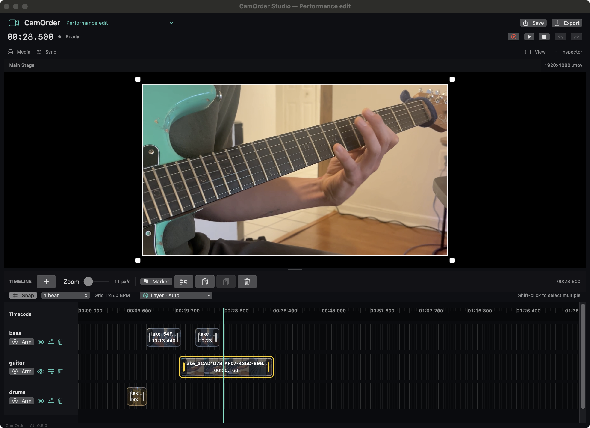

# CamOrder Studio

**A video editor inside Logic Pro.**

Record your cameras or screen, cut to your music, animate your shots, and export a finished movie from the same Logic session. CamOrder Studio gives you video lanes, editing to Logic’s detected tempo, and a Main Stage for framing and layering your shots.

[Download for Mac (DMG)](https://github.com/santismo/CamOrder/releases/latest/download/CamOrder-Studio-Intel.dmg) · [Watch real sessions](https://santismo.github.io/CamOrder/) · [User guide](CamOrderStudio/README-AU.md) · [Application & plug-in history](docs/HISTORY.md)

> **Development build:** the download is for **Intel Macs, macOS 13+**, with an unsigned, non-notarized installer and a locally signed plug-in. Apple silicon builds can be made from source but are not included or validated in this release. Physical camera combinations and real-session sync need checking on your setup.

[](https://santismo.github.io/CamOrder/#workflow)

*The actual CamOrder editor, opened with a real saved performance project in a separate preview window. [Watch the finished movies, see the Logic project, and compare zoom/pan automation with its exported result](https://santismo.github.io/CamOrder/).*

See a [six-lane arrangement and its finished performance](https://santismo.github.io/CamOrder/#full-session), including the saved cuts and framing automation.

## Start recording in Logic

CamOrder runs as an Audio Unit effect. Use one instance on Stereo Out for the whole video project; your audio passes through unchanged.

1. Download and open the **DMG**, then double-click **Install CamOrder Studio.pkg**. Follow the installer; it chooses your account’s Audio Unit folder automatically. Fully quit and reopen Logic afterward. A [direct PKG](https://github.com/santismo/CamOrder/releases/latest/download/CamOrder-Studio-Installer-Intel.pkg) and [ZIP alternative](https://github.com/santismo/CamOrder/releases/latest) are also available.
2. On **Stereo Out**, insert **Audio FX → Audio Units → Santismo → CamOrder Studio → Stereo**. Use one instance for the project.
3. Create a CamOrder project beside your Logic project and choose the **Default** source under **Live Inputs**. Allow camera or screen access for the included **CamOrder Capture** helper.
4. **Arm** a CamOrder lane, then press **Play or Record in Logic**. Also arm a Logic audio track when recording audio. Video keeps recording while you work in Logic's timeline or close the plug-in editor.
5. Stop Logic to finish the take and automatically disarm the video lanes. Arm them again for another take. Edit your regions and **Export** a MOV or MP4.

The installer is unsigned and not notarized. macOS may require approval in **System Settings → Privacy & Security** after opening it; follow [Apple’s instructions](https://support.apple.com/102445) only if you trust the download.

Normal Stereo Out operation uses Logic's Audio Unit transport: no MIDI, MTC or timecode-audio routing is required. See the [recording walkthrough](https://santismo.github.io/CamOrder/#recording) for audio-track and video-lane arming, or the [guide](CamOrderStudio/README-AU.md) for permissions, transport fallback and troubleshooting.

## One camera or several

Every lane starts with the shared **Default** input. Assign another source to a lane when you want another angle; each distinct source gets its own preview. Start with three lanes and add more as needed. Lanes sharing one source share its camera connection and recording file.

Webcams, macOS-exposed iPhone/Continuity Camera inputs, and main-display screen or region capture are supported. Four simultaneous synthetic inputs were verified; physical capacity depends on the devices, USB bandwidth and Mac.

## Edit and export

- A dark, freely resizable editor with adjustable Main Stage, Live Inputs and timeline panels. Inspector, Media and Sync controls open when needed.
- Undo deleted regions while armed, commit lane names with Return or an outside click, and pinch to zoom a timeline that follows the playhead.
- A visible **Save** button and **⌘S**, larger draggable region edges, and **⌘C / ⌘V** to repeat edited regions at the playhead. Copy/paste retains trims, framing and animation and supports Undo.
- Drag regions between lanes, or right-click **Move to Lane**, while keeping their visible timing and sync. **Return to Recorded Position** restores the recorded timing of new takes without discarding trims or automation; both support Undo. Older recordings without a saved recording anchor cannot use Return.
- **Edit to Logic’s beat:** the detected host tempo and beat position drive the grid. Snap cuts, moves and edge trims to beats or subdivisions; Option-drag temporarily bypasses snapping.
- **Shift-click** regions to select several camera angles. **T** or the scissors cuts them together; drag or trim the group with one Undo step. Copy, paste and delete support groups too.
- **Switch cameras as the music plays:** after recording, play the footage with CamOrder focused and press **1–9** for the first nine lanes. Each switch cuts all regions crossing that time and brings the chosen camera forward. Choose **Live cuts: Free / Snap** for exact or beat-snapped switching; Undo reverses the whole switch.
- Drag the numbered lane grip to reorder cameras. **View → Controls at bottom** puts Main Stage above the timeline and all editing/project controls below.
- **Choose the foreground:** select regions and use **Output Layer**, or keys **1–9** while paused. Layer 1 is in front, followed by 2 and 3; numbered borders and badges identify the output order during Main Stage playback and export. Ordinary selection never changes it.
- While paused, **Edit selection** temporarily brings an obscured region forward for framing and automation. Playback and export retain the assigned output order. Click empty timeline space or the outer black canvas margin to deselect.
- Export shows its percentage and a finished notice, with a folder button to reveal the movie in Finder. Progress survives closing and reopening the editor.
- A built-in **Sync → Calculator** compares Logic’s clock with the clock visible in your video, calculates the correction in milliseconds and applies it to the project or one lane.
- Non-destructive lane and project sync adjustments, starting at **0 ms**, applied separately to each lane in playback and export. The movie’s edited start stays fixed, so corrections remain effective when you reimport at the same beat.
- Export the edited timeline, selected region's range, time from the playhead, project origin or a custom range. Trimmed source frames and adjusted positions are preserved.
- A placement note accompanies the movie. Import it into Logic's movie track and place it at the noted start; movie import and positioning are manual.

The [shortcut reference](https://santismo.github.io/CamOrder/#shortcuts) covers selection, grouped cuts and trims, numbered layers, automation markers, deleting, undoing and saving. Use editing shortcuts with CamOrder's editor active; save your Logic project separately too.

Camera takes contain video only. Import a bounced master if you want audio in the exported movie; the plug-in does not capture Logic's mix.

For a clock-based camera calibration walkthrough, see [Measure the delay. Dial it in.](https://santismo.github.io/CamOrder/#camera-sync).

## Build and verify

Requires Xcode and its command-line tools. Apple's AudioUnitSDK is included with its license and pinned revision.

```sh
cd CamOrderStudio
Scripts/build-au.sh
swift test
Scripts/test-au.sh
Scripts/test-session.sh
Scripts/install-au.sh
auval -v aufx CmSt Sntm
```

To build the DMG and native installer from the verified component, run `python3 Scripts/package-installer.py`. See [installer packaging and verification](docs/INSTALLER.md).

Run these sequentially. The default build targets the current Mac; `CAMORDER_ARCH=arm64` or `x86_64` selects one architecture. See the [verification record](docs/VERIFICATION-0.7.1.md) for the tests and their limits.

CamOrder is [MIT licensed](LICENSE). The vendored AudioUnitSDK has its [own license](CamOrderStudio/Vendor/AudioUnitSDK/LICENSE.txt).
