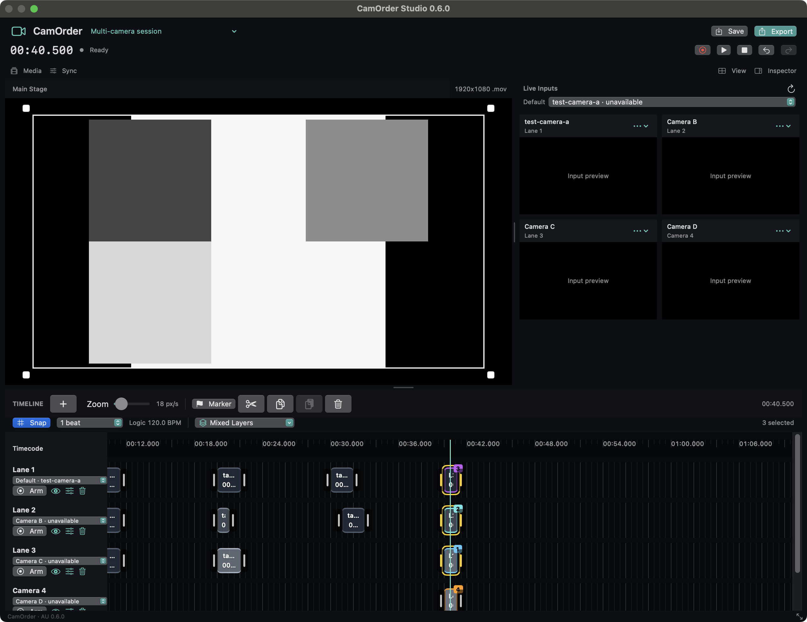

# CamOrder Studio

**Record and edit video inside Logic Pro. One Audio FX plug-in on Stereo Out.**

CamOrder Studio follows Logic's transport, records cameras or your screen into video lanes, and lets you trim, frame and export a movie from the same session. Your audio passes through unchanged.

[Download CamOrder Studio AU 0.6.0](https://github.com/santismo/CamOrder/releases/tag/au-v0.6.0) · [User guide](CamOrderStudio/README-AU.md) · [Application & plug-in history](docs/HISTORY.md)

> **Development build:** the download is for **Intel Macs, macOS 13+**, and is locally signed, not notarized. Apple silicon builds can be made from source but are not included or validated in this release. Physical camera combinations and real-session sync need checking on your setup.



*Actual 0.6.0 editor in a native Audio Unit test host, using simulated cameras and test footage. Logic supplies its own surrounding window controls.*

## Start recording in Logic

1. Download and unzip the release, then run **Install CamOrder Studio.command**. Fully quit and reopen Logic after an update.
2. On **Stereo Out**, insert **Audio FX → Audio Units → Santismo → CamOrder Studio → Stereo**. Use one instance for the project.
3. Create a CamOrder project beside your Logic project and choose the **Default** source under **Live Inputs**. Allow camera or screen access for the included **CamOrder Capture** helper.
4. **Arm** a CamOrder lane, then press **Play or Record in Logic**. Also arm a Logic audio track when recording audio. Video keeps recording while you work in Logic's timeline or close the plug-in editor.
5. Stop Logic to finish the take and automatically disarm the video lanes. Arm them again for another take. Edit your regions and **Export** a MOV or MP4.

Normal Stereo Out operation uses Logic's Audio Unit transport: no MIDI, MTC or timecode-audio routing is required. See the [guide](CamOrderStudio/README-AU.md) for permissions, transport fallback and troubleshooting.

## One camera or several

Every lane starts with the shared **Default** input. Assign another source to a lane when you want another angle; each distinct source gets its own preview. Start with three lanes and add more as needed. Lanes sharing one source share its camera connection and recording file.

Webcams, macOS-exposed iPhone/Continuity Camera inputs, and main-display screen or region capture are supported. Four simultaneous synthetic inputs were verified; physical capacity depends on the devices, USB bandwidth and Mac.

## Edit and export

- A dark, freely resizable editor with adjustable Main Stage, Live Inputs and timeline panels. Inspector, Media and Sync controls open when needed.
- Undo deleted regions while armed, commit lane names with Return or an outside click, and pinch to zoom a timeline that follows the playhead.
- A visible **Save** button and **⌘S**, larger draggable region edges, and **⌘C / ⌘V** to repeat edited regions at the playhead. Copy/paste retains trims, framing and animation and supports Undo.
- **Edit to Logic’s beat:** the detected host tempo and beat position drive the grid. Snap cuts, moves and edge trims to beats or subdivisions; Option-drag temporarily bypasses snapping.
- **Shift-click** regions to select several camera angles. **T** or the scissors cuts them together; drag or trim the group with one Undo step. Copy, paste and delete support groups too.
- **Choose the foreground:** select regions and use **Output Layer** or keys **1–9**. Layer 1 is in front, followed by 2 and 3; numbered borders and badges identify the output order in Main Stage and export. Ordinary selection never changes it.
- A built-in **Sync → Calculator** compares Logic’s clock with the clock visible in your video, calculates the correction in milliseconds and applies it to the project or one lane.
- Non-destructive lane and project sync adjustments, starting at **0 ms**, applied separately to each lane in playback and export. The movie’s edited start stays fixed, so corrections remain effective when you reimport at the same beat.
- Export the edited timeline, selected region's range, time from the playhead, project origin or a custom range. Trimmed source frames and adjusted positions are preserved.
- A placement note accompanies the movie. Import it into Logic's movie track and place it at the noted start; movie import and positioning are manual.

Camera takes contain video only. Import a bounced master if you want audio in the exported movie; the plug-in does not capture Logic's mix.

## Build and verify

Requires Xcode and its command-line tools. Apple's AudioUnitSDK is included with its license and pinned revision.

```sh
cd CamOrderStudio
Scripts/build-au.sh
swift test
Scripts/test-au.sh
Scripts/test-session.sh
Scripts/install-au.sh
auval -v aufx CmSt Sntm
```

Run these sequentially. The default build targets the current Mac; `CAMORDER_ARCH=arm64` or `x86_64` selects one architecture. See the [verification record](docs/VERIFICATION-0.6.0.md) for the tests and their limits.

CamOrder is [MIT licensed](LICENSE). The vendored AudioUnitSDK has its [own license](CamOrderStudio/Vendor/AudioUnitSDK/LICENSE.txt).
